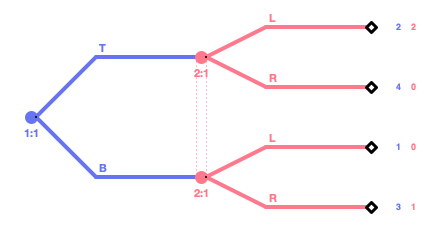
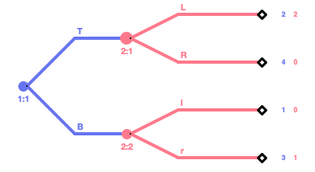
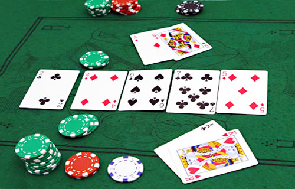
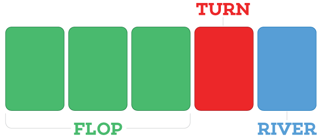
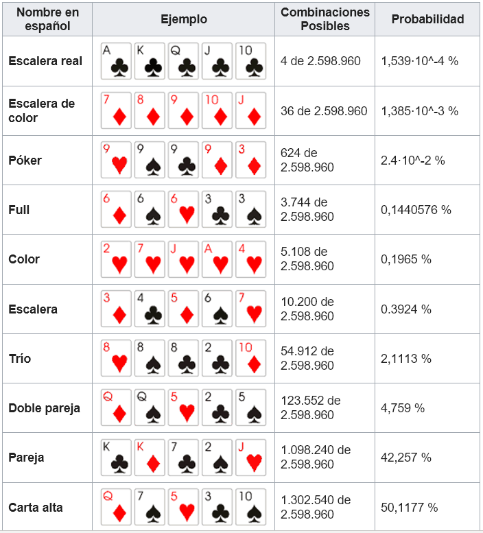
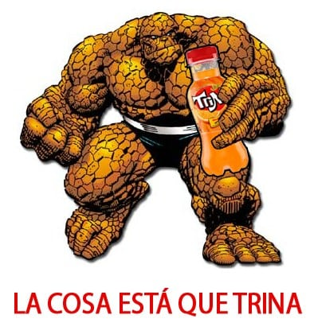
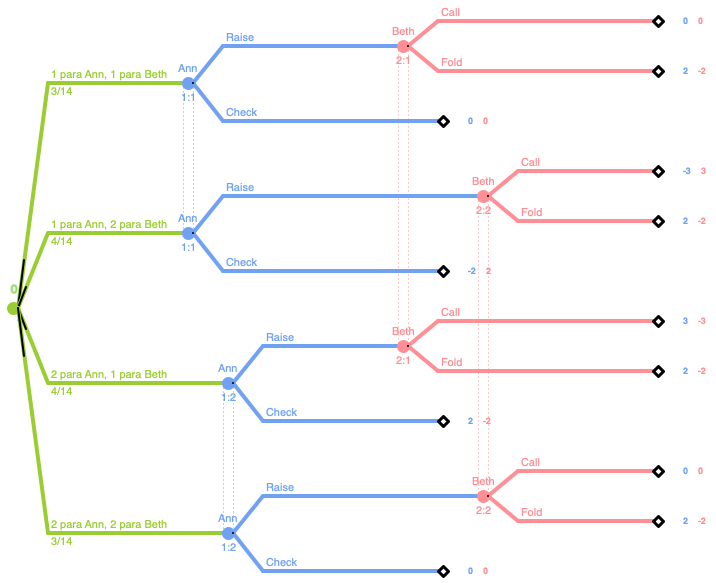
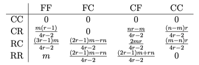
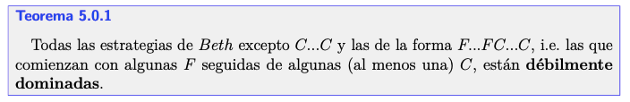
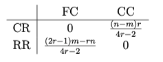

```{r setup, include=FALSE}
options(htmltools.dir.version = FALSE)
knitr::opts_chunk$set(echo = FALSE, include=TRUE, warning = FALSE, message = FALSE,
                      fig.align = "center", out.width = "80%")

library(tidyverse)
library(kableExtra)
library(ggplot2)
library(ggthemes)
```

```{r xaringan-themer, include=FALSE, warning=FALSE}
library(xaringanthemer)

style_duo_accent(
  text_font_size = "12pt",
  primary_color = "#009999",
  secondary_color = "salmon",
  inverse_background_color =  "cornflowerblue",
  colors = c(
    blanco = "white",
    azul = "blue"
  )
)
```

background-image: url(img/cabecera.png)
background-position: 25% 50%
background-size: 130%
class: center, middle, hide-logo

<!-- # .blanco[En esta charla...] -->

<!-- .big[`r emo::ji('joker')`]   .grande[.blanco[ NO se enseñará cómo jugar al Póker]] -->

<!-- .big[`r emo::ji('money with wings')`]   .grande[.blanco[ NO se recomienda participar en juegos de apuestas]] -->

<!-- .big[`r emo::ji('notebook')`]   .grande[.blanco[ Consulte a su matemático de cabecera]] -->

---
class: center, middle, hide-logo

### Empecemos...

<div class="body">
<div id="card-container">
<div id="card">
<div class="back">
</div>
<div class="front">
<div class="number">3</div>
<ol>
	<li>♥</li>
	<li>♥</li>
	<li>♥</li>
</ol>
</div>
</div>
</div>
</div>

---
class: inverse, center, middle, hide-logo

## .blanco[MATEMÁTICAS PREVIAS]

.blanco[(pero no os vayáis todavía, solo lo esencial)]

---
class: middle

### **Probabilidad**

Dado un suceso o evento aleatorio mide el grado de certidumbre de que dicho suceso pueda ocurrir. Sea $\Omega$ el espacio muestral, se define como una función de conjuntos de valor real $P: \Omega \longrightarrow \mathbb{R}\ ([0,1])$ que satisface para un evento $A$: 

a) $P(A)\geq 0$

b) $P(\Omega) = 1$

c) Sea $A_{1}, A_{2}, \ldots$ una secuencia contable de conjuntos disjuntos: $P\Big( \bigcup_{i=1}^{\infty} A_i  \Big)= \sum_{i=1}^{\infty} P(A_i)$

Si los experimentos dan lugar a sucesos equiprobables, según la regla de Laplace: $$P(A) = \frac{\text{Nº de casos favorables}}{\text{Nº de resultados posibles}}$$

**Independencia:** $P(A\cap B) = P(A)P(B)$

**Probabilidad condicional:** $P[A|B] = \frac{P[A\cap B]}{P[B]}$

---

### Baraja inglesa

- <span class="reducida">52 cartas en total</span>

- <span class="reducida">4 palos: &spades; picas, <span class='red_suits'>&hearts;</span> corazones , <span class='red_suits'>&diams;</span> diamantes, &clubs; tréboles</span>

- <span class="reducida">13 cartas para cada palo: $A,2,3,4,5,6,7,8,9,10,J,Q,K$</span>

- <span class="reducida">Cada carta es única</span>

--

<span class="reducida">¿Probabilidad de obtener $K$?</span>

$$P[K] = \frac{4}{52} = \frac{4}{4.13} = \frac{1}{13}$$

--

<span class="reducida">¿Probabilidad de obtener $K$ si ya hemos sacado un $K$ del mazo de cartas?</span>

$$P[K|K] = \frac{4-1}{52-1} = \frac{3}{51} = \frac{1}{17}$$

--

<span class="reducida">Así la probabilidad de obtener pareja de reyes seguidos sería</span>

$$P[K \cap K] = P[K] P[K|K] = \frac{4.3}{52.53} = \frac{1}{221}$$

<span class="reducida">y de esta forma podemos seguir calculando todas las combinaciones posibles.</span>

---
class: middle

### Teoría de juegos

<span class = "reducida"> La **<span class="salmon">Teoría de Juegos</span>** se puede definir como el estudio de modelos matemáticos de conflicto y cooperación entre decisores racionales. </span>

<span class = "reducida"> Un **<span class="salmon">juego</span>** es una situación conflictiva en la que priman intereses contrapuestos. </span>

<span class = "reducida"> La Teoría de Juegos plantea que debe haber una forma **<span class="negro">racional</span>** de jugar a cualquier juego. </span>

#### **Elementos de un juego**

- <span class = "reducida">**Jugadores.** En un conflicto los contendientes son **<span class="negro">racionales</span>** e **<span class="negro">inteligentes</span>**. </span>
- <span class = "reducida">**Reglas.** Aquí se especifican:</span>
  + <span class = "reducida"> **Acciones o alternativas:** elecciones que posee el jugador en cada jugada. </span>
  + <span class = "reducida"> **Conjunto de información:** información que el jugador tiene sobre acciones anteriores. </span>
  + <span class = "reducida"> **Utilidad o pago:** retribución que recibe un jugador al optar por una estrategia. </span>
  
<span class = "reducida"> Los jugadores eligen **estrategias**, una acción o conjunto de acciones para jugar todo un juego. La estrategia es mental. </span>

En un principio, se distinguen dos tipos principales de estrategias:

- **Estrategia pura:** son aquellas en las que no interviene la probabilidad, sino que las elecciones son libres del jugador.
- **Estrategia mixta:** son aquellas en las que interviene la probabilidad. 

---
class: middle

<center></center>

- Juegos no cooperativos vs juegos cooperativos.

- Juegos estratégicos (las jugadas se presentan en el mismo tiempo, **piedra-papel-tijeras**) vs juegos dinámicos (el orden de los turnos de jugada es relevante, **póker**). 

> Dentro de los juegos dinámicos se puede tener información perfecta (**ajedrez**) o imperfecta (**póker**) según si se conocen las acciones previas de los jugadores o no.

- Juego de suma cero (el beneficio de un jugador es la pérdida del otro, **ajedrez** ó **póker**) vs de suma no nula (**dilema del prisionero**).

---
class: middle

### Juegos estratégicos

Un **juego estratégico** o **estático** se define formalmente como la terna $\Gamma =\langle N,A,u \rangle$ donde: 

- $N = \{1,..,n\}$ conjunto no vacío de los $n$ **jugadores**.

- $A = A_1 \times ... \times A_n = \times_{i \in N} A_i$ conjunto de todas las posibles **acciones**.

- $u = (u_1,..,u_n)$ es el perfil de **funciones de utilidad**.

**Piedra-papel-tijeras:**  $N = \{1,2\}$ y $A_i = \{piedra, \ papel, \ tijeras\}$ para cada $i\in N$.

En forma normal:

<center>
<table class="tg">
<thead>
  <tr>
    <th class="tg-ww11"></th>
    <th class="tg-gn06">Piedra</th>
    <th class="tg-gn06">Papel</th>
    <th class="tg-gn06">Tijeras</th>
  </tr>
</thead>
<tbody>
  <tr>
    <td class="tg-gn06">Piedra</td>
    <td class="tg-fybw">0,0</td>
    <td class="tg-fybw">-1,+1</td>
    <td class="tg-fybw">+1,-1</td>
  </tr>
  <tr>
    <td class="tg-gn06">Papel</td>
    <td class="tg-fybw">+1,-1</td>
    <td class="tg-fybw">0,0</td>
    <td class="tg-fybw">-1,+1</td>
  </tr>
  <tr>
    <td class="tg-gn06">Tijeras</td>
    <td class="tg-fybw">-1,+1</td>
    <td class="tg-fybw">+1,-1</td>
    <td class="tg-fybw">0,0</td>
  </tr>
</tbody>
</table>
</center>

---

<br>

### Equilibrio de Nash

Si hay un conjunto de estrategias tal que ningún jugador se beneficia cambiando su estrategia mientras los otros no cambien la suya, entonces ese conjunto de estrategias constituyen un equilibrio de Nash. 

Con un razonamiento puramente matemático, el jugador elige su mejor opción, que trata de ser una anticipación a lo que harán los demás jugadores.

> <span class="reducida"> **Dilema del Prisionero:** Dos sospechosos son puestos en celdas separadas. </span>
- <span class="reducida"> Si ambos confiesan, cada uno será sentenciado a tres años de prisión. </span>
- <span class="reducida"> Si solo uno de ellos confiesa, será liberado y utilizado como testigo contra el otro, quien recibirá una sentencia de cuatro años. </span>
- <span class="reducida"> Si ninguno confiesa, ambos serán condenados por un delito menor y pasarán un año en prisión. </span>

--

```{r}
dt <- tibble(`No confesar`= c("-1, -1", "<u>0</u>, -4"),
             Confesar     = c("-4, <u>0</u>", "<u>-3</u>, <u>-3</u>"))
rownames(dt) <- c("No confesar","Confesar")
kable(dt, "html", booktabs = F, align="c", escape = FALSE, caption = "") %>% 
  column_spec(1, bold = T) %>%
  kable_styling(bootstrap_options = c("hover", "condensed", "responsive"),
                position = "float_left", full_width = FALSE,  font_size = 14)

```

--

<span class="reducida"> El único equilibrio de Nash del juego, $(Confesar, Confesar)$. La estrategia que se debería jugar es la única no óptima desde un punto de vista egoísta. Los jugadores jugarán movimientos que resulten en pagos más bajos para ambos de lo que es posible. </span>

---
class: middle

### Estrategias dominadas

Reglas de dominancia en juegos suma nula (depende de que jugador minimice y cual maximice):

- La regla de las filas, se aplica cuando todos los elementos de una fila son menores o iguales a los elementos correspondientes de otra fila. La fila dominada se puede eliminar.

- La regla de las columnas, se aplica cuando todos los elementos en una columna son mayores o iguales que los elementos correspondientes en otra columna. La columna dominada se puede eliminar.

- La regla de los promedios es cuando una estrategia pura bien puede estar dominada por el promedio de dos o más estrategias puras.

<br>

.pull-left[
<table>
<tbody>
  <tr>
    <td></td>
    <td>b1</td>
    <td>b2</td>
    <td>b3</td>
  </tr>
  <tr>
    <td>a1</td>
    <td>9</td>
    <td>8</td>
    <td>-7</td>
  </tr>
  <tr>
    <td>a2</td>
    <td>3</td>
    <td>-6</td>
    <td>4</td>
  </tr>
  <tr>
    <td>a3</td>
    <td>6</td>
    <td>7</td>
    <td>7</td>
  </tr>
</tbody>
</table>
]

.pull-right[
 <table>
<tbody>
  <tr>
    <td></td>
    <td>b1</td>
    <td>b2</td>
    <td>b3<br></td>
  </tr>
  <tr>
    <td>a1</td>
    <td>9</td>
    <td>8</td>
    <td>-7</td>
  </tr>
  <tr>
    <td>a3</td>
    <td>6</td>
    <td>7</td>
    <td>7</td>
  </tr>
</tbody>
</table>

<table>
<tbody>
  <tr>
    <td></td>
    <td>b1</td>
    <td>b3<br></td>
  </tr>
  <tr>
    <td>a1</td>
    <td>9</td>
    <td>-7</td>
  </tr>
  <tr>
    <td>a3</td>
    <td>6</td>
    <td>7</td>
  </tr>
</tbody>
</table>

]

---
class: middle, hide-logo

### Juego dinámico

Un juego dinámico en forma extensiva consiste en un **árbol dirigido** $T = (X,E)$ con raíz $x_0$.

.pull-left[
<center></center>

##### Estrategias puras

- <span class = "reducida"> Estrategias para 1: $A_1 = \{T,B\}$ </span>
- <span class = "reducida"> Estrategias para 2: $A_2 = \{L,R\}$ </span>

<span class = "reducida"> Los dos nodos unidos por líneas discontinuas tienen el mismo estado de información. </span>
]

.pull-right[
<center></center>

##### Estrategias puras

- <span class = "reducida"> Estrategias para 1: $A_1 = \{T,B\}$ </span>
- <span class = "reducida"> Estrategias para 2: $A_3 = \{Ll,Lr,Rl,Rr\}$ </span>

<span class = "reducida"> Donde, por ejemplo $Ll$ significa que el jugador 2 hace $L$ si el jugador 1 hace $T$ y hace $l$ si el jugador 1 hace $B$. </span>
]

Todo juego dinámico o en forma extensiva se puede llevar a forma normal.

---
class: inverse, center, middle, hide-logo

## .blanco[PÓKER]

.blanco[(por fin)]

---
class: middle

### Texas Hold'em

.pull-left[
<center></center>
<center></center>
]

.pull-right[
<center></center>
]

---

### Algunos cálculos rápidos...

¿Número de posibles combinaciones de 5 cartas?

$$C_5^{52} = {52 \choose 5} = \frac{52!}{5!47!} = 2,598,960$$

--

¿Probabilidad de que nuestra mano contenga una pareja?

$${13 \choose 1}{4 \choose 2}{12 \choose 3}{4 \choose 1}{4 \choose 1}{4 \choose 1} = \frac{13}{1}\cdot \frac{4.3}{2.1}\cdot \frac{12.11.10}{3.2.1}\cdot \frac{4}{1}\cdot \frac{4}{1}\cdot \frac{4}{1} = 1,098,240.$$

Primero elegimos que número va a formar la pareja. Como hay cuatro cartas posibles, elegimos dos. Las tres cartas restantes se eligen de distinto número, pudiendo ser de 4 palos distintos. Por lo tanto llegamos a que

$$\frac{1098240}{2598960} \approx .42257$$

---
class: center

<br>

## PROBLEMAS

Muchas combinaciones posibles $\longrightarrow$ problema combinatorio

Falta de información (cartas rivales) $\longrightarrow$ juego de información imperfecta

--

### ¿Y ahora qué?

--

## PILLERÍA MATEMÁTICA

Simplificamos el juego

---
class: inverse, center, middle, hide-logo

### .blanco[La cosa se pone interesante...]

---
class: center, middle, hide-logo

### De hecho

<center></center>

---
class: middle

### VNM-Póker

El juego consta de cuatro parámetros: $S$, $r$, $n$, y $m$, con $m<n$. Hay cartas de valor 1 a $S$ en un mazo, y cada valor ocurre $r$ veces, $S\cdot r$ cartas en total. Hay dos jugadores, $Ann$ y $Beth$. Cada jugador recibe aleatoriamente una carta del mazo, la mira, pero no se la muestra a su oponente. El *ante* es $m$, lo que significa que ambos jugadores ponen $m$ monedas, se suponen de igual valor, en el bote al comienzo del juego. La apuesta de cada jugador puede aumentar a $n$ si el jugador pone $n-m$ dólares adicionales. El juego es de **suma cero**.

#### Reglas del VNM-Póker(S,r,m,n)

> <span class = "reducida"> $Ann$ mueve primero eligiendo entre **pasar** $(check)$, jugar por $m$, o **subir** $(raise)$, jugar por $n$. </span>
- <span class = "reducida"> Si $Ann$ **pasa**, ambas cartas se revelan y el jugador con la carta más alta obtiene el bote de $2m$. En el caso de un empatar, obtener la misma carta, el dinero se divide en partes iguales y cada uno tiene lo mismo que al principio. </span>
- <span class = "reducida"> Si $Ann$ **sube**, aumenta su apuesta total a $n$. Entonces $Beth$ tiene dos opciones, **retirarse** $(fold)$ o **ir** $(call)$. </span>
  + <span class = "reducida"> Si $Beth$ se **retira**, $Ann$ obtiene el dinero del bote de $n + m$, es decir, gana $m$. La carta de $Beth$ no se revela. </span>
  + <span class = "reducida"> Si $Beth$ **va**, aumenta su apuesta a $n$. Entonces se revelan ambas cartas y el jugador con la carta más alta obtiene el $2n$ en el bote; es decir, gana $n$. En caso de empate, el dinero se divide en partes iguales. </span>
  
<span class = "reducida"> Enlace al juego: <https://albtorval.shinyapps.io/IA_Juegos_Proyecto/> </span>

---
class: center, hide-logo

#### **VNM-Póker(2,4,2,3)**



---
class: middle

#### **VNM-Póker(2,r,m,n)**

##### **Probabilidades**

- <span class = "reducida"> Los casos donde $Ann$ y $Beth$ tienen cartas de igual valor $x$, presentan probabilidad $$p_{xx} = \frac{1}{S} \cdot \frac{r-1}{rS-1} = \frac{r-1}{S(rS-1)}.$$ </span>
- <span class = "reducida"> Los casos donde $Ann$ y $Beth$ tienen cartas de distinto valor, $x$ e $y$, presentan probabilidad $$p_{xy} = \frac{1}{S} \cdot \frac{r}{rS-1} = \frac{r}{S(rS-1)}.$$ </span>

##### **Estrategias**

- <span class = "reducida"> $Ann$:  { $CC$ (prudente), $CR$ (razonable), $RC$ (inútil), $RR$ (agresiva) }. </span>
- <span class = "reducida"> $Beth$: { $FF$ (prudente), $FC$ (razonable), $CF$ (contraintuitiva), $CC$ (agresiva) }. </span>

---
class: middle

#### **VNM-Póker(2,r,m,n)**

##### **Forma normal**

<center></center>

##### **Relaciones de dominancia**

<center></center>

<span class = "reducida"> Eliminando las estrategias débilmente dominadas obtenemos, </span>

<center></center>

---
class: hide-logo

#### **VNM-Póker(2,r,m,n) - Análisis del juego**

<span class = "reducida"> La entrada $\frac{(n-m)r}{4r-2}$ es siempre positiva. Si $\frac{(2r-1)m - rn}{4r-2}$ no es positivo, entonces la estrategia de $Ann$ $CR$ domina débilmente a $RR$, y la estrategia de $Beth$ $FC$ domina débilmente a $CC$. Por la tanto, hay un **<span class = "salmon">equilibrio de Nash puro</span>** $(CR,FC)$. </span>

<span class = "reducida"> Si suponemos que somos $Ann$ y asumimos que $Beth$ juega una estrategia mixta: elige $FC$ con probabilidad $q$ y $CC$ con probabilidad $1-q$. **<span class="negro">¿Cuándo respondería $Ann$ a la estrategia mixta con $CR$ y cuándo con $RR$?</span>** El pago que recibe $Ann$ al jugar $CR$ es $\frac{(1-q)(n-m)r}{4r-2}$ que es mayor o igual que el pago al jugar $RR$, que es $\frac{q((2r-1)m-rn)}{4r-2}$, si</span>

<span class = "reducida"> $$q^* = \frac{(n-m)r}{(r-1)m} \geq q.$$ </span>

<span class = "reducida"> $Ann$ debe jugar la estrategia razonable $CR$ cuando $Beth$ juega $FC$ con probabilidad menor que $q^*$, si $Beth$ juega demasiado agresivo. En otro caso, $Ann$ debería jugar la estrategia agresiva $RR$. Ídem para $Beth$ y así llegamos a obtener el **<span class = "salmon">equilibrio mixto</span>**. </span>

<span class = "reducida"> $$p = \frac{(2r-1)m-rn}{(r-1)m} \quad \text{y} \quad q = \frac{(n-m)r}{(r-1)m}.$$ </span>

.footnote[<span class = "reducida"> En el texto también se presenta el cálculo estrategias de comportamiento usando estrategias mixtas y viceversa. </span>]

---
class: center, middle

### En resumen...

> *Gran parte del dinero que ganarás al póker no procederá de la brillantez de tu juego, sino de la ineptitud de tus oponentes.*

Lou Krieger

***

Por si hay tiempo: <https://albtorval.shinyapps.io/IA_Juegos_Proyecto/> 

---
class: center, middle

### Gracias

<center></center>

o en mi página web: [torrejonvalenzuela.com](https://torrejonvalenzuela.com/)
